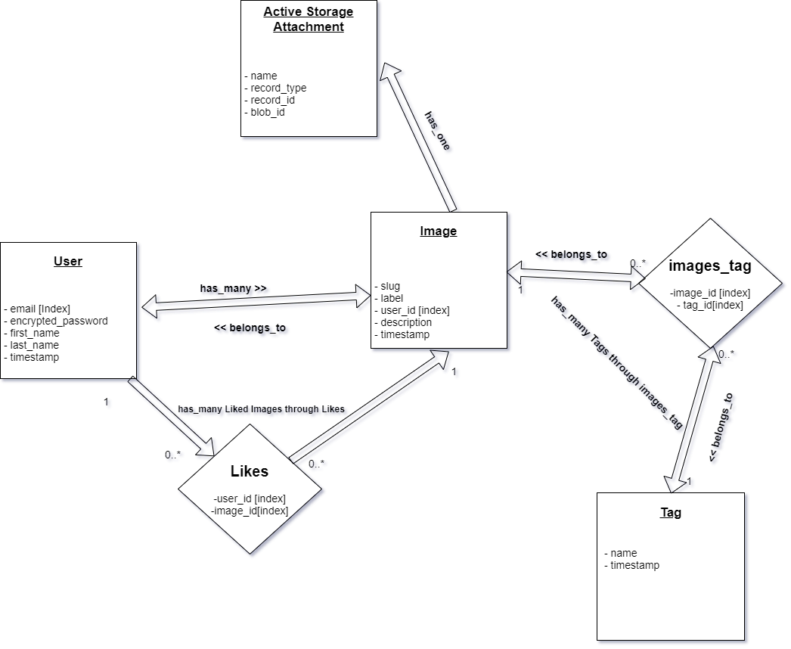

# image-repository
Graphiql Playground: https://stock-pics.herokuapp.com/graphiql
#### Tech Stack
```
Ruby on Rails  
GraphQl
React
```

#### Requirements 

```
* ruby 2.7.0p0
* rails 6.0.3.2
* postgres 10
```
* Setup
```
git clone https://github.com/amanpatel123/image-repository.git
cd image-repository
bundle install
yarn
rails db:setup
rails db:migrate
rails s

Once all the above step's are performed, go to: 
- http://localhost:3000/graphiql
and use Graphiql playGround to create a user or two (SignUp Page yet to implement, currenlty focusing on major parts)

Mutation to create user: 

mutation createUser($input: CreateUserInput!){
  userCreate(input: $input){
    user {
      email
      fullName
    }
    errors
  }
}

Example Input: 
{
  "input": {
    "userAttributes": {
      "email": "myemail@gmail.com",
      "firstName": "first",
      "lastName": "last",
      "password": "password"
    }
  }
}

Once the user is created, go to http://localhost:3000/ and login. 
```

#### How to run the test suite
`rspec`

#### Associations



#### Deployment
Heroku

#### This is my submission to Shopify's backend challenge Summmer 2021. Following are the features:

- Ability to upload images to `disk` if in `development` environment and on s3 bucket if in `production` environment.
  - This is being done using **Active Storage**. An image have a photo attached to it. 
- Application also have an ability to view their uploads and all uploads
  - User have access to view anyone's image, even if they are not loggedin to the system (Access Controll)
- Deleting an Image
  - Only the user to which the Image **belongs_to** have access to deletion of the image (Access Controll)
- Pagination **(Cursor based pagination)** and displaying Images in sorted fashion
   - This is done using the GraphQl Relay (Connection)
- Search based on Image Tags
  - Using a GraphQl mutation to query **Active Record** for images based on . Every Image has a tag attached, which is assigned or created while saving an Image to DB
 - Like Image
   - Any authenticated User can Like an image (Access Controll)

#### Upcomming
- Bulk Upload
- Search by Photographer nam
- Refactoring
